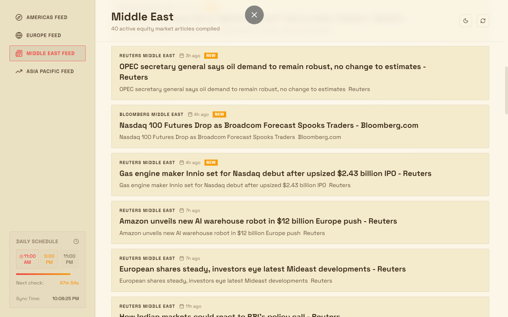
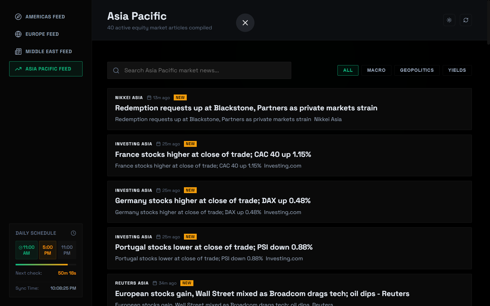
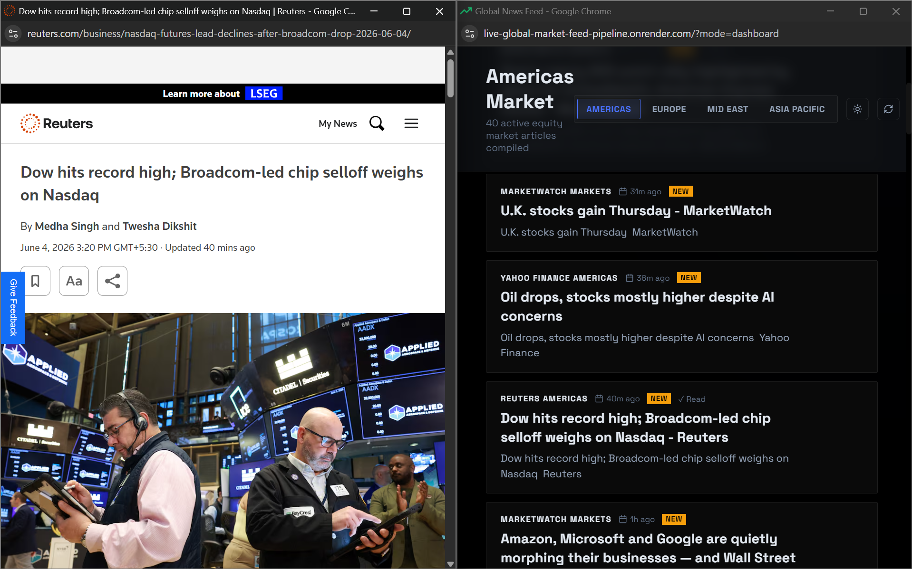

# Market Feed Dashboard

A polished full-stack market pulse aggregator that combines global macro news, relevance scoring, regional feed desks, and a tiled split-view workspace.

The project includes:
- A Node.js/Express backend that aggregates RSS feeds, decodes Google News redirect URLs, filters noise, and exposes a clean JSON API.
- A React + Vite frontend with responsive dashboards, style modes, article filtering, and split-screen article previews.

---

## 📸 Visual Preview

### Dark mode dashboard
Live feed overview with market region counts, headline scores, and a polished glassmorphism UI.


### Sepia reading mode
Warm-toned variant optimized for long reading sessions and low contrast.



### Asia region feed
Regional feed panel showing the Asia Pacific desk and per-article momentum.



### Filtered market view
Search and filtering in action for faster macro topic discovery.


### Split-screen article preview
Tiled workspace view with dashboard and proxied article content side-by-side.



---

## ✨ Key Features

- Multi-region news aggregation: Americas, Europe, Middle East, Asia Pacific
- Intelligent relevance filtering to remove noise from corporate press releases
- Automated article scoring by source authority, macro triggers, and freshness
- Split-screen tiled reader with a clean proxied article view
- Read/unread tracking via browser local storage
- Dark and sepia visual themes with responsive dashboard layouts

---

## 🛠️ Architecture

### Backend
- Express API server (`backend/index.js`)
- RSS aggregation with `rss-parser`
- Google News URL decoding via `google-news-url-decoder`
- Clean article extraction using `jsdom` and `@mozilla/readability`

### Frontend
- React + Vite app in `frontend/`
- Dynamic feed dashboard, filters, and schedule tracker
- Minimal CSS with theme variants and adaptive layout

---

## 🚀 Getting Started

### Prerequisites
- Node.js v18 or later
- npm

### Install dependencies
From the project root:
```bash
npm run install-all
```

### Run in development mode
```bash
npm run dev
```
Open `http://localhost:5173` in your browser.

### Build for production
```bash
npm run build
npm start
```
Then visit `http://localhost:3001`.

---

## 🐳 Docker

Build the Docker image:
```bash
docker build -t market-feed-dashboard .
```

Run the Docker container, passing the required environment variables:
```bash
docker run -d -p 3001:3001 --name market-dashboard -e GOOGLE_CLIENT_ID="your-client-id.apps.googleusercontent.com" market-feed-dashboard
```
Open `http://localhost:3001`.

---

## 🔑 Authentication Configuration (Google OAuth)

The dashboard supports Google Sign-In to sync starred and "read later" articles across devices.

### Local Development Setup
1. Copy `.env.example` to `.env` in the root folder and configure `GOOGLE_CLIENT_ID`.
2. Copy `frontend/.env.example` to `frontend/.env` and configure `VITE_GOOGLE_CLIENT_ID`.
3. In your Google Cloud Console, under **Authorized JavaScript origins**, make sure to add:
   - `http://localhost:5173` (Vite dev server)
   - `http://localhost:3001` (production build server)

### Production Setup
1. In your hosting platform (e.g., Render, Heroku), define the environment variable:
   - **Key**: `GOOGLE_CLIENT_ID`
   - **Value**: Your Google Client ID
2. In Google Cloud Console, add your production domain (e.g., `https://your-app-name.onrender.com`) to the **Authorized JavaScript origins**.

---

## 🔌 API Endpoints

### `GET /api/config`
Retrieves public application configurations (such as the Google Client ID loaded dynamically from backend environment variables).

### `GET /api/news`
Returns aggregated, filtered, and scored news items across supported regions.

### `GET /api/proxy?url=<article-url>`
Proxies a target article URL for the dashboard's split-screen reader view.

### `POST /api/auth/google`
Verifies a Google token credential received from the frontend and registers or retrieves the user profile.

### `POST /api/auth/mock`
Performs a mock developer sign-in locally without hitting Google API servers.

### `GET /api/saved`
Retrieves starred and "read later" article lists for a specific user.
* **Headers**: Requires `X-User-Id` (the user's unique Google ID).

### `POST /api/saved`
Updates and syncs user starred and "read later" article lists.
* **Headers**: Requires `X-User-Id`.
* **Body**: `{ starred: { ... }, readLater: { ... } }`
