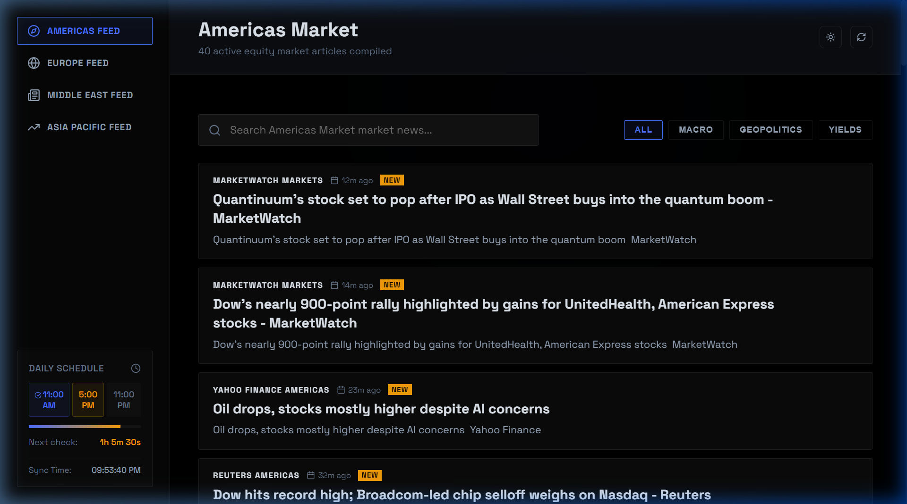
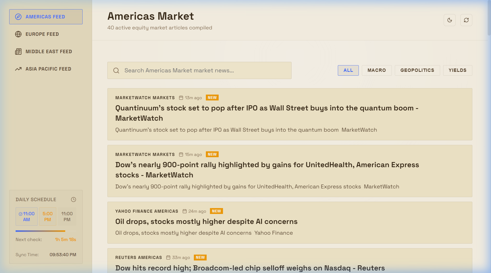
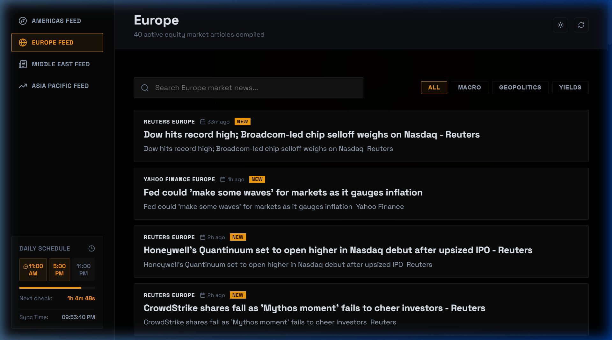
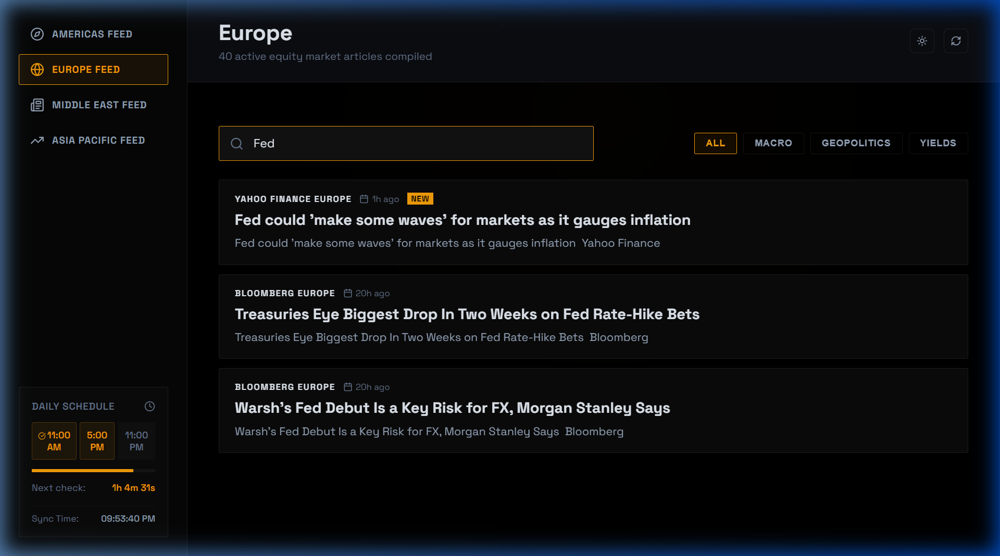

# 🌐 Global Market Pulse Aggregator & Dashboard

An elegant, real-time aggregated market news pipeline and analytical dashboard. The application compiles global equity market feeds across four major regions (Americas, Europe, Middle East, and Asia Pacific) with intelligent relevance filtering, automated scoring, and a tiled workspace view.

---

## 📸 Screenshots

### 🌓 Premium Dark Mode
Detailed view of the main Americas Feed with live index counts, macro-driver statistics, real-time sync timers, and active scheduled reading checkpoints.


### 📜 Retro Sepia Mode
An alternative high-contrast warm color palette optimized for extended reading comfort.


### 🌍 Regional Desks (Europe Feed)
Seamless transition between international desks (e.g., Europe, Middle East, Asia Pacific) with independent tracking and styling.


### 🔍 Real-Time Filter & Search
Instantly filter articles by key topics (Macro, Geopolitics, Yields) or perform full-text fuzzy search.


---

## ✨ Key Features

- **Multi-Region Aggregation**: Compiles financial feeds across 4 major regions (Americas, Europe, Middle East, Asia Pacific) from premier sources like Reuters, Bloomberg, CNBC, MarketWatch, Nikkei Asia, Economic Times, and Livemint.
- **Intelligent Relevance Filtering**: Automatically filters out corporate noise (e.g., individual earnings reports or press releases) unless they have broader macro-economic significance.
- **Automated Score & Rank**: Grades articles based on:
  - Source authority tier (Tier 1 vs. Tier 3)
  - Key macro triggers (Fed rate changes, inflation, bond yields, energy index)
  - Publication freshness (boosts very recent articles)
- **Tiled Split Workspace**: Clicking an article can launch a side-by-side workspace: the Dashboard on the left half of the screen and a clean, proxied version of the full article on the right half.
- **Synchronized Schedule Tracker**: Visualizes the daily reading schedule (11:00 AM, 5:00 PM, 11:00 PM) with progress meters and custom countdowns.
- **Read/Unread State Tracking**: Uses local storage to mark read articles with clear checkmarks (`✓ Read`) and dimmed cards for optimized feed digestion.
- **Interactive Custom Styles**: Supports instant toggle between neon-glow Dark Mode and bookish Sepia Mode.

---

## 🛠️ Tech Stack & Architecture

```mermaid
graph TD
    A[Google News RSS Feeds] -->|Raw XML| B[Express Backend API]
    B -->|rss-parser / axios| C[Raw Feed Parser]
    C -->|google-news-url-decoder| D[URL Resolver]
    D -->|Relevance & Noise Filter| E[Scoring Engine]
    E -->|JSON Response| F[React + Vite Frontend]
    F -->|Local Storage| G[Read/Unread Tracker]
    F -->|Multi-Window API| H[Tiled Workspace Viewer]
```



### Backend
- **Node.js + Express**: Core REST API layer.
- **RSS Parser**: Clean XML-to-JSON aggregation.
- **Google News URL Decoder**: Decodes obfuscated redirect links into their direct destination URLs.
- **Readability & JSDOM**: Scrapes and formats articles for a clean, ad-free reader proxy.

### Frontend
- **React + Vite**: Ultra-fast hot-reloading single-page application.
- **Lucide React**: Vector icon library.
- **Vanilla CSS**: Curated, neon-glow glassmorphism and tailored dark/sepia design systems.

---

## 🚀 Quick Start & Installation

### 1. Prerequisites
Ensure you have **Node.js** (v18+) and **npm** installed.

### 2. Install Dependencies
Run the global installation helper script from the root directory to setup the workspace, backend, and frontend dependencies:
```bash
npm run install-all
```

### 3. Run in Development
Start the concurrent dev servers (Backend API on port `3001` and Vite Dev Server on port `5173`):
```bash
npm run dev
```
Open **[http://localhost:5173](http://localhost:5173)** in your browser.

> [!NOTE]
> If your browser blocks popups, make sure to allow popups from `localhost` to use the tiled side-by-side workspace window layout.

### 4. Build & Run in Production
Compile the React frontend to static assets and start the production server:
```bash
# Build frontend static files
npm run build

# Start production server
npm start
```
The application will serve the backend API and host the built static frontend concurrently at **[http://localhost:3001](http://localhost:3001)**.

---

## 🐳 Docker Deployment

The application features a multi-stage Docker setup to build the React client and run the Node service:

```bash
# Build the Docker image
docker build -t market-feed-dashboard .

# Run the container
docker run -d -p 3001:3001 --name market-dashboard market-feed-dashboard
```
Access the dashboard at **[http://localhost:3001](http://localhost:3001)**.

---

## 🔌 Backend API Reference

### 1. Get Aggregated News
- **Endpoint**: `/api/news`
- **Method**: `GET`
- **Description**: Gathers RSS feeds across all regions, decodes their Google links, filters out corporate noise, scores them, and returns a sorted structure.
- **Sample Response**:
```json
{
  "success": true,
  "timestamp": 1717523620000,
  "data": {
    "americas": {
      "regionName": "AMERICAS",
      "articles": [
        {
          "id": "guid-or-link",
          "title": "Fed holds interest rates steady as inflation remains sticky",
          "link": "https://www.reuters.com/.../fed-holds-rates",
          "pubDate": "Thu, 04 Jun 2026 15:45:00 GMT",
          "isoDate": 1780589100000,
          "source": "Reuters Americas",
          "summary": "The Federal Reserve left its benchmark rate unchanged...",
          "tier": 1,
          "score": 87
        }
      ]
    }
  }
}
```

### 2. Read Proxy
- **Endpoint**: `/api/proxy`
- **Method**: `GET`
- **Parameters**: `url` (the target article URL to scrape)
- **Description**: Bypasses frame constraints (`X-Frame-Options` / `CSP`) to proxy the web page for the split reader view.
